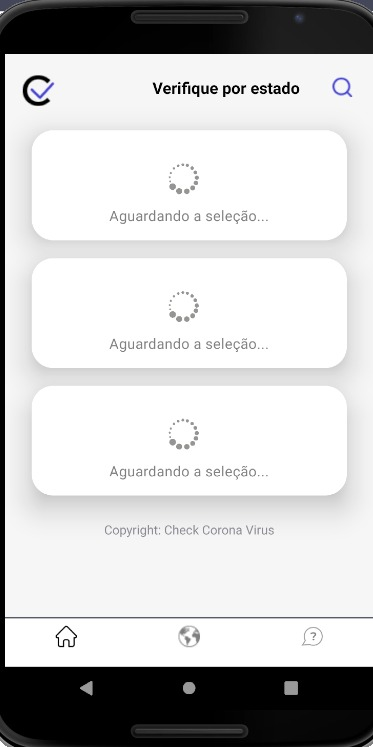
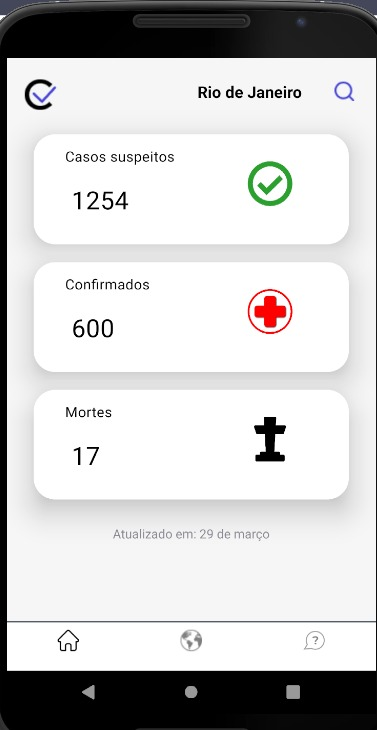
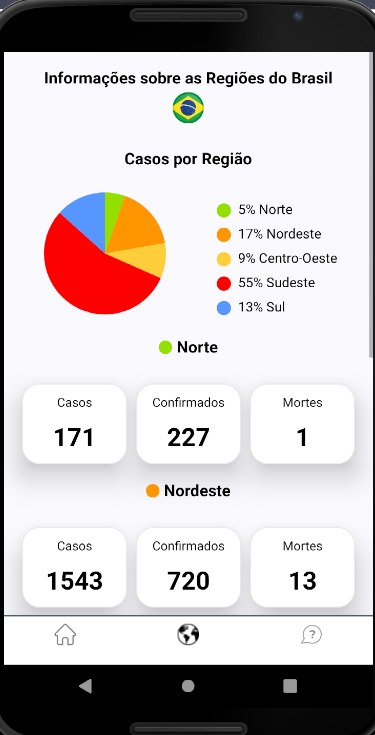

<p align="center">
  <a href="https://github.com/lucassouza97/checkcoronav">
    
 </a>
  
<h3> Check Corona Virus </h3>

Devido a pandemia do COVID-19 que tem assustado todo o mundo, jutantamente a um amigo [Daniel Matheus](https://www.linkedin.com/in/daniel-matheus-785606129/) decidimos criar um app que trouxesse as informações atuais sobre os casos que vem sido descobertos no Brasil. Decidimos criar o app baseado na stack do react native, ao pesquisar na web encontramos a API [COVID-19](https://covid19-brazil-api-docs.now.sh/) do Arthur Ribeiro que busca os dados através de um crawler diretamente do site do Ministério da Saúde. Tivemos o auxílio do Marlon Machado(UX) que desenhou as telas, e do Jonas Emanuel(FullStack) que nos apoiou tirando algumas dúvidas. 


<h3>O que foi utilizado?</h3>

- [React Native](https://reactnative.dev/)
- [Date-fns](https://github.com/date-fns/date-fns)
- [React Navigation](https://reactnavigation.org/)
- [React Native Chart Kit](https://www.npmjs.com/package/react-native-chart-kit#pie-chart)
- [React Native Select Two](https://www.npmjs.com/package/react-native-select-two)
- [React Native Vector Icons](https://github.com/oblador/react-native-vector-icons)
- [React Native Picker Select](https://github.com/lawnstarter/react-native-picker-select)
- [Styled Components](https://styled-components.com/)
- [JavaScript](https://developer.mozilla.org/pt-BR/docs/Web/JavaScript)


Também foram utilizados o eslint, prettier e editor config para estilização e formatação do código.
- [ESLint](https://github.com/eslint/eslint)
- [Prettier](https://github.com/prettier/prettier)
- [EditorConfig](https://editorconfig.org/)

<h3>Link disponível para Download:<h3>
<span>https://drive.google.com/file/d/1ELJVc-Z_pmwdViQRS0v8PCjKUFWXQWUI/view</span>

<h3>Telas</h3>
<div class="row" style="box-sizing: border-box;">
 <div class="column" style="width: auto; height: auto; padding: 10px; float: left;">
  <h4>Tela 1</h4>
    
  </div>
  <div class="column" style="width: auto; height: auto; padding: 10px; float: left;">
    <h4>Tela 2</h4>
    
  </div>
 <div class="column" style="width: auto; height: auto; padding: 10px; float: left;">
    <h4>Tela 3</h4>
    
  </div>
</div>

<h4><strong>Para executar o projeto:</strong></h4>

É necessário possuir o ambiente do React Native instalado:
- [Instale o ambiente](https://docs.rocketseat.dev/ambiente-react-native/introducao)

1. Abra o terminal e digite:</br>

```
git clone <url-repositório>
```

2. Entre na pasta do projeto via terminal e digite:

```
npm install  ou  yarn install

```

3. Por último, execute a linha abaixo no terminal: 

```
yarn start 
```
ou
```
npm start
```
<br/>


